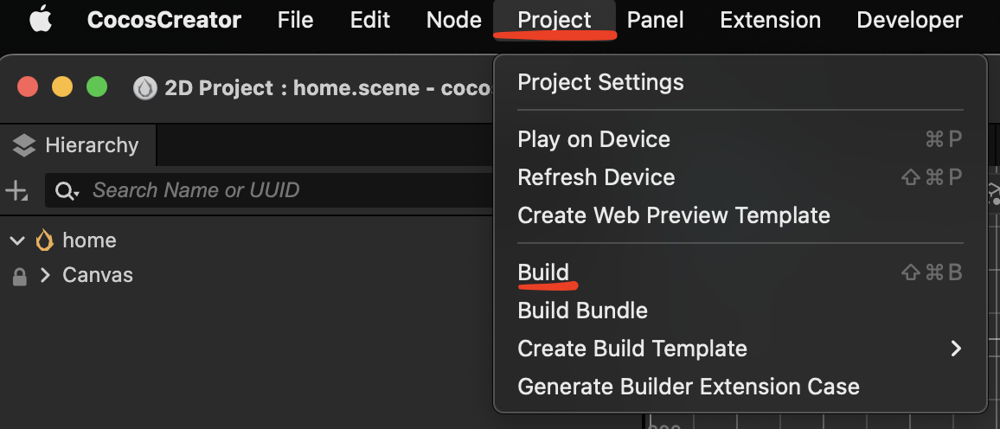
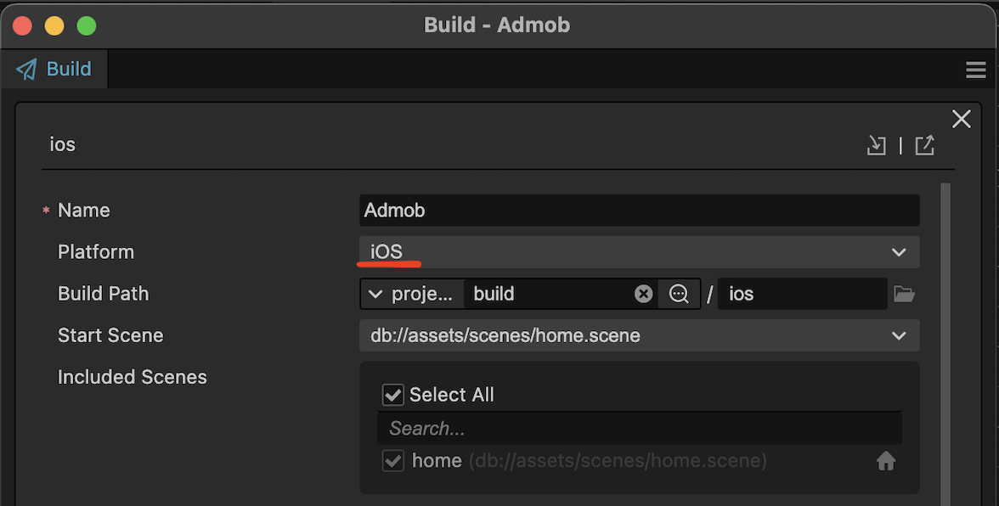
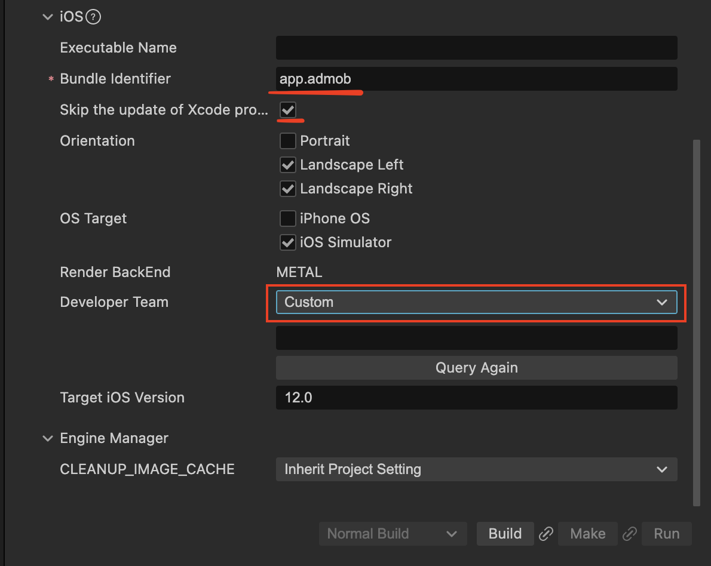
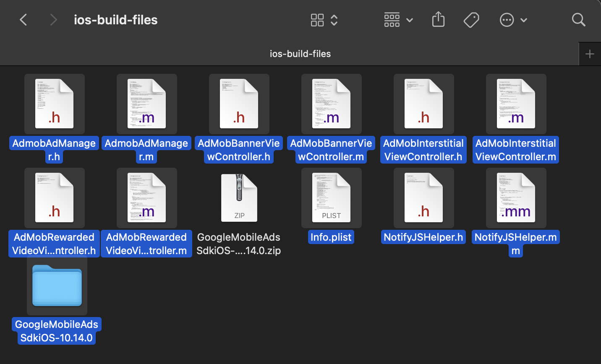
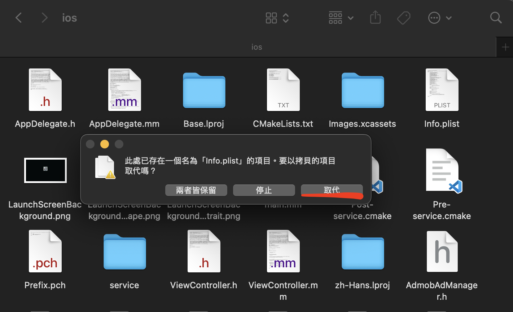

# Cocos Creator 3.8 Admob iOS app

## Setup
1. 使用 Cocos Creator 打開專案
2. npm i
3. 進行 Build iOS. ( Project -> Build -> New Build Task -> 下方步驟做完 -> Build )

3. 將 `native-ios-build-files` 中的 `GoogleMobileAdsSdkiOS-10.14.0.zip` 解壓縮，並將所有檔案 「選取」-> 「複製」。(.zip除外)

4. 前往 /native/engine/ios，將檔案「 貼上 」&「 取代 」。

//TODO 等下一版補充